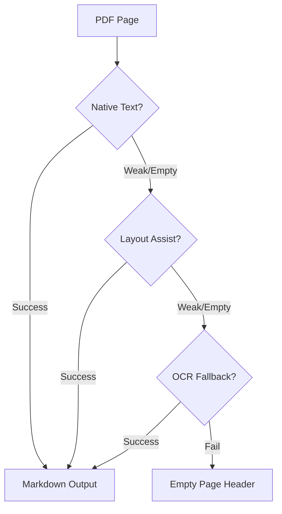

# 📄 PDF to Markdown Converter (`pdftomd`)

<p align="center">
  
  
  
  
</p>

<p align="center">
  <strong>PDF를 고품질 마크다운 문서로 변환하는 가장 스마트한 방법</strong><br>
  단순한 텍스트 추출을 넘어 OCR과 레이아웃 분석을 통해 구조화된 문서를 생성합니다.
</p>

---

## 🌟 Key Highlights

| ⚡ Fast & Light | 🎯 High Accuracy | 🛠️ Pro-CLI |
| :--- | :--- | :--- |
| **메모리 효율적 스트리밍**<br>대용량 PDF도 메모리 걱정 없이 안정적으로 처리하는 페이지 단위 파이프라인 | **다단계 변환 전략**<br>Native $\rightarrow$ Layout Assist $\rightarrow$ OCR 순의 정밀한 텍스트 복구 | **하이브리드 인터페이스**<br>전문가를 위한 상세 옵션부터 초보자를 위한 마법사 모드까지 지원 |

---

## 🚀 왜 `pdftomd` 인가요?

많은 PDF 변환 도구들이 겪는 **고질적인 문제들**, `pdftomd`는 이렇게 해결합니다.

- ❌ **메모리 고갈**: 대용량 파일 처리 시 시스템이 멈추는 현상 $\rightarrow$ ✅ **Streaming Pipeline**으로 해결
- ❌ **텍스트 유실**: 이미지 내 글자나 스캔 문서 인식 불가 $\rightarrow$ ✅ **RapidOCR Fallback**으로 해결
- ❌ **구조 파괴**: 페이지 구분 및 문서 흐름 상실 $\rightarrow$ ✅ **Stable Page Headers** 및 구조 유지 전략으로 해결

---

## 🛠️ 설치 가이드

### 1️⃣ 필수 요구사항
- **Python 3.10+**
- **Poppler**: OCR 기능을 위해 반드시 필요합니다.

<details>
<summary><b>📦 OS별 Poppler 설치 방법 (클릭하여 펼치기)</b></summary>

- **Ubuntu/Debian**: `sudo apt update && sudo apt install -y poppler-utils`
- **macOS**: `brew install poppler`
- **Windows**: [poppler-windows](https://github.com/oschwartz10612/poppler-windows/releases)에서 최신 릴리즈 다운로드 $\rightarrow$ `bin` 폴더를 시스템 **PATH**에 추가
</details>

### 2️⃣ 빠른 설치
터미널에서 아래 명령어를 입력하여 OCR 지원 버전으로 즉시 설치하세요.

```bash
# 프로젝트 루트 디렉토리에서 실행
python -m pip install ./cli[full]
```

---

## 📖 사용 설명서

### 🛠️ 기본 변환 (Basic)
가장 빠르고 간단하게 변환하는 방법입니다.

```bash
# 기본 텍스트 추출 변환
pdftomd convert input.pdf -o output.md --force

# [추천] OCR 기능을 활성화하여 스캔 문서까지 완벽하게 변환
pdftomd convert input.pdf --ocr-fallback --ocr-engine rapidocr -o output.md --force
```

### ⚙️ 고급 제어 (Advanced)
전문적인 튜닝이 필요할 때 사용하는 옵션들입니다.

```bash
# 🚀 멀티코어 활용으로 속도 극대화 (Worker 4개 사용)
pdftomd convert input.pdf --workers 4 -o output.md --force

# ✂️ 대용량 문서를 20페이지 단위로 분할 저장
pdftomd convert input.pdf --split-every 20 -o output.md --force

# 📜 세로쓰기 문서 또는 고전 한문 특화 변환
pdftomd convert input.pdf --ocr-fallback --ocr-layout vertical --ocr-classical-zh-postprocess -o output.md --force
```

### 🪄 마법사 모드 (Interactive)
옵션 설정이 어렵다면 대화형 인터페이스를 이용하세요.

```bash
pdftomd convert --wizard
```
- **Fast**: 속도 우선, 기본 텍스트 중심
- **Balanced**: 속도와 정확도의 균형 (추천)
- **Accurate**: 최대 정확도, 강력한 OCR 적용

---

## 🧠 변환 엔진 작동 원리 (Engine Routing)

`pdftomd`는 최적의 결과를 위해 다음과 같은 **결정론적 라우팅**을 수행합니다.



| 단계 | 트리거 | 사용 엔진 | 범위 |
| :--- | :--- | :--- | :--- |
| **1. Native** | 항상 실행 | `pdfminer.six` | 모든 페이지 |
| **2. Layout** | 텍스트 부족 시 | `pdfplumber` | 취약 페이지 전용 |
| **3. OCR** | 최종 수단 | `RapidOCR` | 최종 취약 페이지 |

---

## 📂 출력 및 디렉토리 안내

- **자동 관리**: 지정한 출력 폴더가 없을 경우, CLI가 **자동으로 생성**하고 친절하게 안내합니다.
- **기본 경로**: `-o` 옵션을 생략하면 다음과 같은 구조로 저장됩니다.
  `downloads/ <파일명> / <파일명>.md`

---

## ❓ 트러블슈팅

- **`pdftoppm not found`**: Poppler가 설치되지 않았거나 PATH 설정이 누락된 경우입니다. 설치 가이드를 다시 확인하세요.
- **메모리 이슈**: 아주 큰 파일의 경우 `--workers 1` 옵션을 사용하거나 `--split-every` 옵션으로 분할 처리를 권장합니다.


Or install directly from repo root:

```bash
python -m pip install ./cli[full]
```

If you want only the CLI core (no OCR):

```bash
cd cli
python -m pip install .
```

### Linux (Ubuntu/Debian)

```bash
# Install Python 3.10+ (if needed)
sudo apt update
sudo apt install -y python3.10 python3.10-venv python3.10-dev

# Install Poppler (required for OCR)
sudo apt install -y poppler-utils

# Create virtual environment and install
cd cli
python3 -m venv .venv
source .venv/bin/activate
python -m pip install -U pip
python -m pip install -r requirements.txt

# Verify installation
pdftomd --help
```

### macOS

```bash
# Install Python via Homebrew (if needed)
brew install python@3.11

# Install Poppler (required for OCR)
brew install poppler

# Create virtual environment and install
cd cli
python3 -m venv .venv
source .venv/bin/activate
python -m pip install -U pip
python -m pip install -r requirements.txt

# Verify installation
pdftomd --help
```

### Windows

```powershell
# Install Python 3.10+ from https://www.python.org/downloads/
# Check "Add Python to PATH" during installation

# Install Poppler for OCR (using Conda - recommended)
conda install -c conda-forge poppler

# Or download Poppler for Windows manually:
# https://github.com/oschwartz10612/poppler-windows/releases/
# Extract and add to PATH: C:\Program Files\poppler\Library\bin

# Create virtual environment
cd cli
python -m venv .venv
.\.venv\Scripts\Activate.ps1

# Install packages
python -m pip install -U pip
python -m pip install -r requirements.txt

# Verify installation
pdftomd --help
```

If you get PowerShell execution policy error:

```powershell
Set-ExecutionPolicy -ExecutionPolicy RemoteSigned -Scope CurrentUser
```

## Usage

### Hybrid CLI (v1 default)

```bash
pdftomd --help
pdftomd convert --help
pdftomd init
pdftomd config show
pdftomd profile list
```

### Basic Conversion

```bash
# Simple conversion (native text only)
pdftomd convert test.pdf -o test.md --force

# With OCR fallback
pdftomd convert test.pdf --ocr-fallback --ocr-engine rapidocr -o test.md --force

# With multiple workers
pdftomd convert test.pdf --workers 4 -o test-workers.md --force

# Split output into chunks (10 pages each)
pdftomd convert test.pdf --split-preset 10 -o test.md --force

# Split output every 20 pages with parallel OCR
pdftomd convert test.pdf --split-every 20 --ocr auto --split-ocr-parallel --ocr-engine rapidocr -o test.md --force
```

### Interactive Modes

Start interactive wizard:

```bash
pdftomd convert --wizard
```

Wizard presets:
- `fast`: native-first, OCR fallback off
- `balanced`: OCR fallback on, `rapidocr` backend
- `accurate`: OCR fallback on, `rapidocr` backend

Start full terminal interactive mode (CTL style):

```bash
pdftomd convert --ctl
```

### Legacy Path (still supported in v1)

```bash
.venv/bin/python pdf_to_md.py test.pdf -o test.md --force
```

Legacy-style hybrid invocation with deprecation warning:

```bash
pdftomd test.pdf -o test.md --force
```

## Engine Routing

The converter uses deterministic routing in this order:

| Stage | Trigger | Engine | Scope |
| --- | --- | --- | --- |
| Native text | Always | `pdfminer.six` | All pages |
| Layout assist | `--ocr-fallback` and weak page text | `pdfplumber` | Weak pages only (bounded) |
| OCR fallback | `--ocr-fallback` and weak pages remain | `rapidocr` | Weak pages only (windowed) |

Note: `--ocr-engine` accepts only `rapidocr`.

## Config and Profiles

The hybrid CLI resolves conversion options with this precedence:

```
CLI > env > profile/config > defaults
```

```bash
# Initialize config
pdftomd init

# Config management
pdftomd config validate
pdftomd config show

# Profile management
pdftomd profile list
pdftomd profile set team ocr_mode strict
pdftomd profile use team

# Use profile
pdftomd convert input.pdf --profile team -o out.md --force
```

Environment variables:

- `PDF_TO_MD_CONFIG`, `PDF_TO_MD_OUTPUT`, `PDF_TO_MD_FORCE`
- `PDF_TO_MD_OCR_MODE`, `PDF_TO_MD_OCR_ENGINE`, `PDF_TO_MD_OCR_LAYOUT`
- `PDF_TO_MD_CLASSICAL_ZH_POSTPROCESS`, `PDF_TO_MD_KEY_CONTENT_FALLBACK`, `PDF_TO_MD_PROFILE`
- `PDF_TO_MD_SPLIT_PRESET` (10/20/50/100), `PDF_TO_MD_SPLIT_EVERY` (positive int)
- `PDF_TO_MD_WORKERS` (positive int)

## Error Behavior

- No-arg usage error -> exit code `2`
- Missing input PDF file -> exit code `1`
- Output exists without `--force` -> exit code `1`
- Conversion failure -> exit code `1` with `Conversion failed:` prefix
- Runtime config/profile validation failure -> exit code `1`

## Troubleshooting

### `pdftoppm not found` error

Poppler is not installed or not in PATH:

- Linux: `sudo apt install poppler-utils`
- macOS: `brew install poppler`
- Windows: See Windows installation section above

### Memory issues with large PDFs

Reduce memory usage with these options:

```bash
# Disable parallel processing
pdftomd convert large.pdf --workers 1 -o output.md --force

# Split into smaller chunks
pdftomd convert large.pdf --split-every 10 -o output.md --force
```

### OCR quality issues

For better OCR quality:

```bash
# For vertical text documents
pdftomd convert input.pdf --ocr-fallback --ocr-engine rapidocr --ocr-layout vertical -o output.md --force

# For classical Chinese/ancient documents
pdftomd convert input.pdf --ocr-fallback --ocr-engine rapidocr --ocr-classical-zh-postprocess -o output.md --force

# Combined options
pdftomd convert input.pdf --ocr-fallback --ocr-engine rapidocr --ocr-layout vertical --ocr-classical-zh-postprocess --ocr-key-content-fallback -o output.md --force
```
